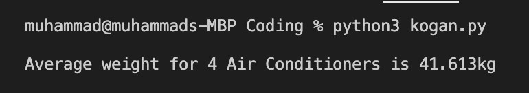

# Kogan.com Coding Challenge

Using the provided (paginated) API, find the average cubic weight for all products in the "Air Conditioners" category.

Cubic weight is calculated by multiplying the length, height and width of the parcel. The result is then multiplied by the industry standard cubic weight conversion factor of 250.

## Language Used
Python3


## Installation instructions for Python3 can be found here

MAC OSX: https://docs.python-guide.org/starting/install3/osx/.   
Windows: https://docs.python.org/3/using/windows.html

## Usage

Run this command in terminal, make sure to be in the directory where Kogan.py file is located.

```bash
python3 kogan.py  
```
## Output

Output will look something like this



## Developer
Developed by Muhammad Ali Nayani for Kogan.com
